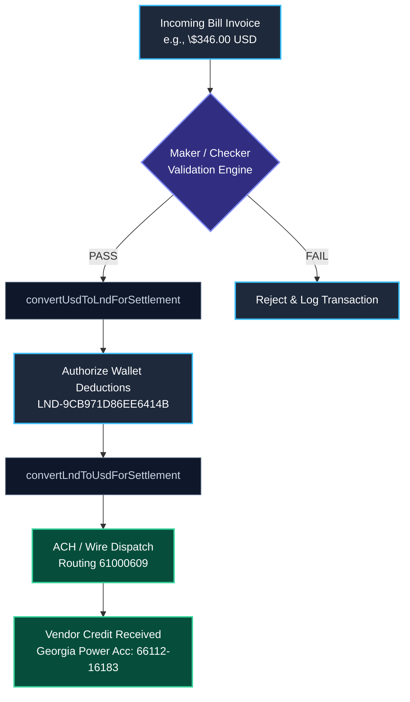

```mermaid
graph TD
    %% Define Styles and Colors
    classDef primary fill:#1e293b,stroke:#38bdf8,stroke-width:2px,color:#fff;
    classDef process fill:#0f172a,stroke:#64748b,stroke-width:1px,color:#cbd5e1;
    classDef gateway fill:#312e81,stroke:#818cf8,stroke-width:2px,color:#fff;
    classDef banking fill:#064e3b,stroke:#34d399,stroke-width:2px,color:#fff;

    %% Workflow Steps
    A[Incoming Bill Invoice<br/>e.g., \$346.00 USD]:::primary --> B{Maker / Checker<br/>Validation Engine}:::gateway
    
    B -- PASS --> C[convertUsdToLndForSettlement]:::process
    B -- FAIL --> X[Reject & Log Transaction]:::primary
    
    C --> D[Authorize Wallet Deductions<br/>LND-9CB971D86EE6414B]:::primary
    D --> E[convertLndToUsdForSettlement]:::process
    
    E --> F[ACH / Wire Dispatch<br/>Routing 61000609]:::banking
    F --> G[Vendor Credit Received<br/>Georgia Power Acc: 66112-16183]:::banking

    %% Assign styles
    class A,D,X primary;
    class C,E process;
    class B gateway;
    class F,G banking;
```
